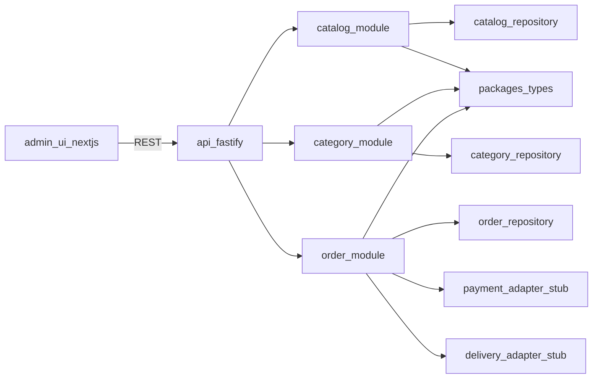

# Технический план: каталог, категории и заказы (admin + api)

## Статус выполнения

- Статус документа: `in_progress`
- Последнее обновление: `2026-03-16`
- Задачи:
  - [x] Зафиксировать общий scope первой итерации.
  - [x] Зафиксировать ключевые решения по MVP.
  - [x] Этап 1: Доменная модель и контракты.
  - [x] Этап 2: API модуль каталога.
  - [x] Этап 3: API модуль категорий.
  - [x] Этап 4: API модуль заказов.
  - [x] Этап 5: Админка.
  - [ ] Этап 6: Нефункциональные требования и стабилизация.

## Фактический прогресс реализации

- `done`: Базовая инфраструктура API (`Prisma 7`, `PostgreSQL`, Docker-baseline).
- `done`: `catalog` API (CRUD, publish/unpublish, bulk publish, storefront visibility rules).
- `done`: `categories` API (tree, CRUD, инварианты глубины 2 уровня, soft delete).
- `done`: `orders` API и state machine (переходы статусов + автоархив + trackNumber validation).
- `done`: Базовые admin UI-экраны для `catalog/categories/orders` с реальными API.
- `in_progress`: Стабилизация — внедрен auth middleware для write endpoints + login/logout/me в API.

## Цель

Определить поэтапную реализацию первой рабочей итерации `admin + api` по доменам каталог, категории и заказы.

## Scope

- Реализация backend-модулей `catalog`, `categories`, `orders`.
- Реализация admin-экранов и операций управления по этим доменам.
- Подготовка интерфейсов интеграций (payment/delivery/import), без полноценного подключения провайдеров.

## Ключевые решения

- MVP заказов: ядро + интерфейсы/заглушки интеграций.
- Доступ в админку: один админ-аккаунт (без ролей на старте).
- Остатки: ручное ведение + готовность к будущему импорту CSV/XLS.
- Статусы заказа: `created`, `paid`, `archived` (auto after 20 min if unpaid), `shipped` (with track number), `delivered`.
- Публикация товара: по умолчанию `isPublished=false` при ручном создании и импорте.
- Выключенный товар полностью скрыт с витрины (листинги/поиск/карточка по прямой ссылке).
- Включение/выключение товара выполняется в админке, включая bulk-операции.

## Связанные документы

- [Технические требования](000-tech-requirements.md)
- [Спецификация характеристик товаров по категориям](002-product-attributes-schema.md)

## Что переиспользуем из текущего каркаса

- API bootstrap и модульную регистрацию в [apps/api/src/app.ts](apps/api/src/app.ts).
- Текущий orders-модуль как точку расширения в [apps/api/src/modules/orders/index.ts](apps/api/src/modules/orders/index.ts).
- Стартовые shared-типы в [packages/types/src/index.ts](packages/types/src/index.ts).
- Заготовки админ-фич в [apps/admin/src/features/catalog/index.ts](apps/admin/src/features/catalog/index.ts) и [apps/admin/src/features/orders/index.ts](apps/admin/src/features/orders/index.ts).

## Целевая архитектура доменов

## Этап 1. Доменная модель и контракты (API-first)

- Расширить [packages/types/src/index.ts](packages/types/src/index.ts) доменными DTO/командами:
  - **Catalog**: `Product`, `ProductVariant`, `ProductImage`, `ProductFilter`, `ProductSort`.
  - **Category**: `Category` c фиксированной глубиной 2 уровня (`parentId` nullable).
  - **Order**: `Order`, `OrderItem`, `OrderStatus`, `DeliveryMethod`, `PaymentMethod`, `TrackingInfo`.
- Зафиксировать enums/валидацию статусов:
  - `created -> paid`
  - `created -> archived` (по таймауту 20 минут)
  - `paid -> shipped` (обязателен track number)
  - `shipped -> delivered`
- Учесть правило ТЗ: цветовые варианты товара как отдельные карточки каталога (отдельные SKU/товары), размеры отображаются явно.

## Этап 2. API модуль каталога

- Расширить [apps/api/src/modules/catalog/index.ts](apps/api/src/modules/catalog/index.ts):
  - `GET /api/catalog` (фильтры: категория, размер, цвет, price range, сортировка asc/desc).
  - `GET /api/catalog/:id`.
  - `POST /api/catalog`, `PATCH /api/catalog/:id`, `DELETE /api/catalog/:id` (admin only).
  - `PATCH /api/catalog/:id/publish` и bulk endpoint для массового включения/выключения.
- Вынести бизнес-логику из route handlers в application/domain слой внутри `src/modules/catalog/`*:
  - `application` (use-cases), `domain` (rules), `infrastructure` (repo).
- Подготовить структуру для остатков:
  - поля количества на уровне SKU/размер,
  - интерфейс будущего импортера `StockImportPort` (без реализации импорта в этой итерации).
- Зафиксировать правила видимости:
  - на storefront доступны только `isPublished=true`,
  - для `isPublished=false` карточка недоступна по прямой ссылке.

## Этап 3. API модуль категорий

- Добавить новый модуль `categories` в [apps/api/src/modules](apps/api/src/modules):
  - `GET /api/categories/tree`.
  - `POST /api/categories`, `PATCH /api/categories/:id`, `DELETE /api/categories/:id`.
- Ограничение инвариантов:
  - максимум 2 уровня вложенности,
  - запрет циклов,
  - запрет удаления категории с активными товарами (или soft delete с проверкой).
- Подключить модуль в [apps/api/src/modules/index.ts](apps/api/src/modules/index.ts) и [apps/api/src/app.ts](apps/api/src/app.ts).

## Этап 4. API модуль заказов

- Расширить [apps/api/src/modules/orders/index.ts](apps/api/src/modules/orders/index.ts):
  - `GET /api/orders` (list + filters by status/date).
  - `GET /api/orders/:id`.
  - `PATCH /api/orders/:id/status` (валидация переходов статусов).
  - `POST /api/orders` (создание заказа из checkout payload).
- Реализовать правило автоархивации неоплаченного заказа через 20 минут:
  - доменный сервис + планировщик/периодическая задача (внутри API на старте).
- Подготовить интеграционные порты (stub adapters):
  - `PaymentPort` (создание платежа, проверка статуса),
  - `DeliveryPort` (создание отправления, трек-номер).

## Этап 5. Админка (Next.js)

- Развернуть фичи в [apps/admin/src/features/catalog/index.ts](apps/admin/src/features/catalog/index.ts) и [apps/admin/src/features/orders/index.ts](apps/admin/src/features/orders/index.ts), добавить `features/categories`.
- Для каждой фичи разделить:
  - `ui` (таблицы/формы),
  - `model` (state + actions),
  - `api` (клиент к Fastify endpoints),
  - `index.ts` как public API.
- Экран каталога:
  - CRUD товара, фото, характеристики, размеры, цена, остатки.
  - Переключение публикации товара (`включен/выключен`) и bulk-публикация.
- Экран категорий:
  - дерево 2 уровней + управление привязкой к товарам.
- Экран заказов:
  - список, карточка, смена статуса, ввод track number при `shipped`.

## Этап 6. Минимальные нефункциональные требования

- Валидация входных данных API (schema-first подход на уровне модулей).
- Единые коды ошибок и contract error payload для админки.
- Аудит-поля в сущностях (`createdAt`, `updatedAt`, `createdBy` where applicable).
- Подготовка к аналитике и интеграциям через adapter interfaces, без подключения провайдеров в этой итерации.

## Критерии готовности первой итерации

- Админка покрывает CRUD каталога и категорий + операционное управление заказами.
- API реализует весь оговоренный статусный flow заказа и валидацию переходов.
- Модель остатков поддерживает ручное ведение и готова к будущему импорту CSV/XLS.
- Контракты вынесены в shared types и используются согласованно `admin <-> api`.
- Модули изолированы по ответственности, без прямых cross-feature импортов.

## Out of scope

- Реальные интеграции платежной системы и служб доставки.
- Полноценная RBAC-модель админки.
- Полная автоматизация импорта/синхронизации остатков с внешними системами.
